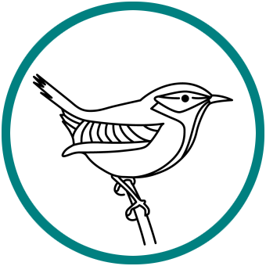

# World of Warships Renamer

Does what it says on the tin. A utility that can rename ships in the [World of Warships] game by
[Wargaming.net]. Hence, **W**orld of Warships **Ren**amer &rarr; **wren**.

<p align="center">
  
</p>

## Usage

It goes without saying that the changes made by this program are local and only visible in your
own game client.

Before running the program, ensure the `wowsPath` at the top of the configuration file points to
the relevant directory on your computer.

```text
$ wren --help
Usage: wren [OPTIONS] [CHANGESETS]...

  wren = Warships RENamer. A utility that can rename ships in the World of
  Warships game by Wargaming.net.

  Applies all changes found in the list of CHANGESETS, as defined in the
  provided config file.

  Example:

      $ wren radar cyrillic

Options:
  -c, --config PATH  Path to config file.  [default: ./wren.cfg]
  -u, --undo         If provided, the original names will be reinstated.
  --help             Show this message and exit.```
```

Available changesets in the packaged version are:

* `cyrillic` for replacing the names of all Russian ships with their Cyrillic alphabet equivalent.
* `joker` for renaming a certain ship. See if you can spot it!
* `radar` for prefixing the name of all (potentially) radar-equipped ships with their radar range,
  e.g. `φ10 Minotaur`.
* `radarNoRange` for prefixing the name of all (potentially) radar-equipped ships a radar marker,
  e.g. `φ Minotaur`.

## Development environment setup

* Assumes you have `pipenv` installed and in your path.
* Assumes Windows 10.

```bash
pipenv install --dev
```

*Et voilà!* 😉

## TODO

* Enter all substitions in `wren.cfg`.
* Clean out TODOs in the source files.
* Fix `.ico` file in different sizes ([manually](https://superuser.com/a/491198),
  [script](https://superuser.com/a/683203), [action](https://github.com/jruipinto/ImageMagick-action))

---

[![Code style: black][black-badge-img]][black-badge-href]
[![Conventional commits][conventional-commits-badge-img]][conventional-commits-badge-href]
[![Requirements Status][requirements-badge-img]][requirements-badge-href]
[![Updates][pyup-badge-img]][pyup-badge-href]

![Build status, main branch][github-actions-main-badge-img]
![Build status, dev branch][github-actions-dev-badge-img]
[![Code coverage][codecov-badge-img]][codecov-badge-href]
[![Technical debt][sonarcloud-badge-img]][sonarcloud-badge-href]

---

[black-badge-href]: https://github.com/psf/black
[black-badge-img]: https://img.shields.io/badge/code%20style-black-000000.svg
[codecov-badge-href]: https://codecov.io/gh/kthy/wren
[codecov-badge-img]: https://codecov.io/gh/kthy/wren/branch/main/graph/badge.svg
[conventional-commits-badge-href]: https://www.conventionalcommits.org/en/v1.0.0/
[conventional-commits-badge-img]: https://img.shields.io/badge/conventional%20commits-1.0.0-blue.svg
[github-actions-dev-badge-img]: https://github.com/kthy/wren/workflows/build-dev/badge.svg
[github-actions-main-badge-img]: https://github.com/kthy/wren/workflows/build-main/badge.svg
[pyup-badge-href]: https://pyup.io/repos/github/kthy/wren/
[pyup-badge-img]: https://pyup.io/repos/github/kthy/wren/shield.svg
[requirements-badge-href]: https://requires.io/github/kthy/wren/requirements/?branch=main
[requirements-badge-img]: https://requires.io/github/kthy/wren/requirements.svg?branch=main
[sonarcloud-badge-href]: https://sonarcloud.io/dashboard?id=kthy_wren
[sonarcloud-badge-img]: https://sonarcloud.io/api/project_badges/measure?project=kthy_wren&metric=sqale_index
[Wargaming.net]: https://wargaming.com/
[World of Warships]: https://worldofwarships.eu/
